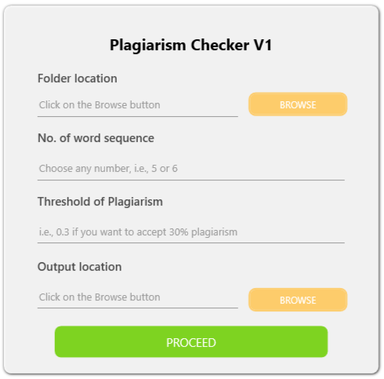

# Summary
Plagiarism, from an academic perspective, is defined as an act of presenting other people’s ideas, statements or works as their own [@anderson2011problem]. It is always a matter of concern in universities and other academic institutions as this is quite common among students while submitting any assignments or reports. Teachers face difficulties in grading students’ assignments with a higher degree of judgment and waste their valuable time to identify plagiarism. In addition to that plagiarism has a serious effect on the learning objectives and creative thinkings of students. This software focuses on building an effective, simple and robust tool for plagiarism detection on text-based electronic assignments to minimize this issue and help teachers in conducting the proper evaluation of assignments and reports. Though text retrieval research has yielded some mature systems that are successful to detect copied or moderately altered text in an input document, those are well-suited to detect plagiarism of copy-paste type only [@weber2014false]. Researchers have proposed numerous approaches to improve the text-similarity assessment methods by adopting methods like paraphrasing, sentence matching or keyword matching [@gupta2016study]. However, none of those are freely available as well as they do not fulfill the actual need of academic faculties and instructors. To fulfill the aforementioned issues, **AcPgChecker** focuses on providing an effective tool for academic faculties and instructors to detect plagiarism in text-based electronic assignments. 

# Statement of the Need
Most of the plagiarism detection tools available for text plagiarism detection are not freely available. However, freely available plagiarism checkers (e.g. [Small Seo](https://smallseotools.com/plagiarism-checker/), [PlagScan](https://www.plagscan.com/en/),    and [Plagiarisma](http://plagiarisma.net/)) impose  some text  limits. Moreover, none of the existing tools aim is to serve busy academics who want to make sure that the reports or assignments they are marking is as plagiarism free as possible. The software throws  light  on  the  immense research   potential   in   this   field   for   developing   efficient intelligent detection systems so as to curb unethical acts in students’ assignments as well as in examination papers. Furthermore, the software can be used as a base tool for detecting plagiarism in different languages.

# Functionality and Features
**AcPgChecker** is windows based desktop tool which provides some essentials and unique features for academic faculties and instructors -

* The software does not require users to upload each document separately. The user only needs to browse the directory that contains all the documents.
* The current version supports pdf documents only but it can be extended to other file formats in the future.
* The output is presented in csv format containing the student identification numbers and percentage of similarity among the documents.
* Users can customize the number of word sequences of similarity.
* The threshold of plagiarism is also customizable depending on user needs.

# References